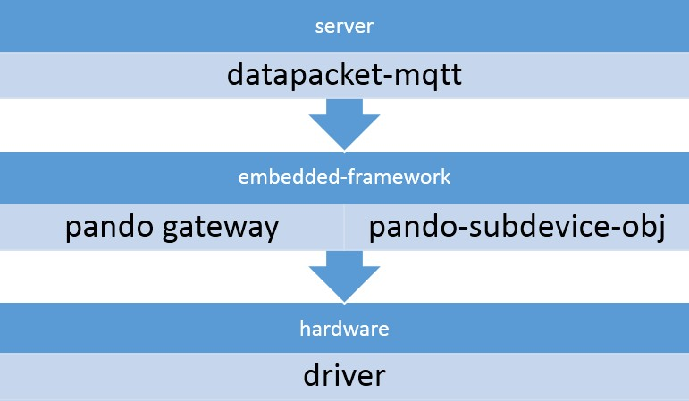

# embeded-framework-summary
the main responsibilities of the pando-embeded-framwork:  
 
- maintain the main gateway business, such as, register, login, access, etc.  
- abstract the common interface of hardware, define the device operation object.  
- unpack the data packet from the server and control the device; pack the info of the device, and upload to the server. 

###main summary of the framework
 

